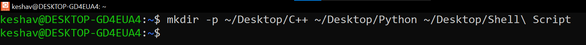
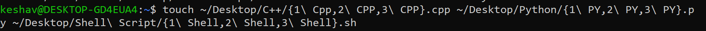
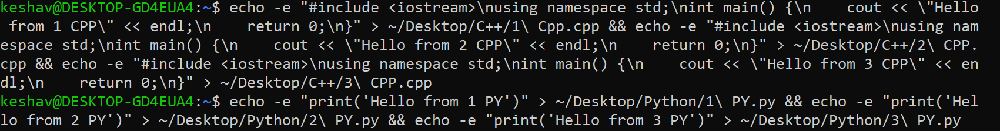
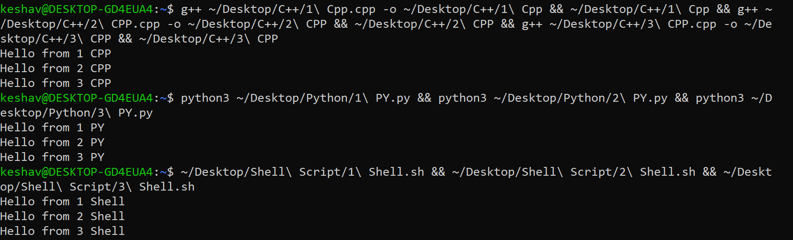

Step 1 Create Folders Run the following command to create three folders: C++, Python, and Shell Script: mkdir -p ~/Desktop/C++ ~/Desktop/Python ~/Desktop/Shell\ Script Install C++ Compiler and Python

Step 2 Create Files Create three files in each folder using a single command:  touch ~/Desktop/C++/{1\ Cpp,2\ CPP,3\ CPP}.cpp
~/Desktop/Python/{1\ PY,2\ PY,3\ PY}.py
~/Desktop/Shell\ Script/{1\ Shell,2\ Shell,3\ Shell}.sh

Step 3 Assign Permissions Make all files executable: chmod +x ~/Desktop/C++/*.cpp ~/Desktop/Python/*.py ~/Desktop/Shell\ Script/*.sh

Step 4 Add Basic Code Add basic code to each file using echo:

.png)

Step 5 Execute Files Run C++ Files, Python and Shellscript files

